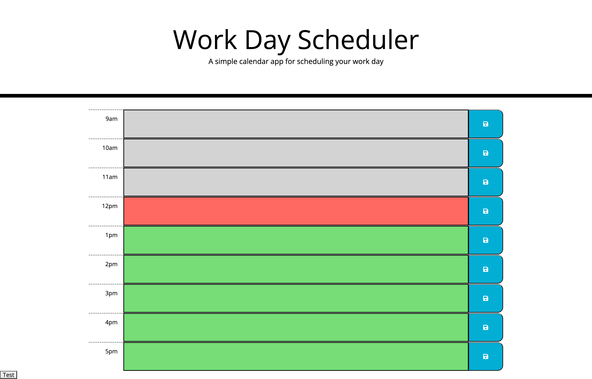
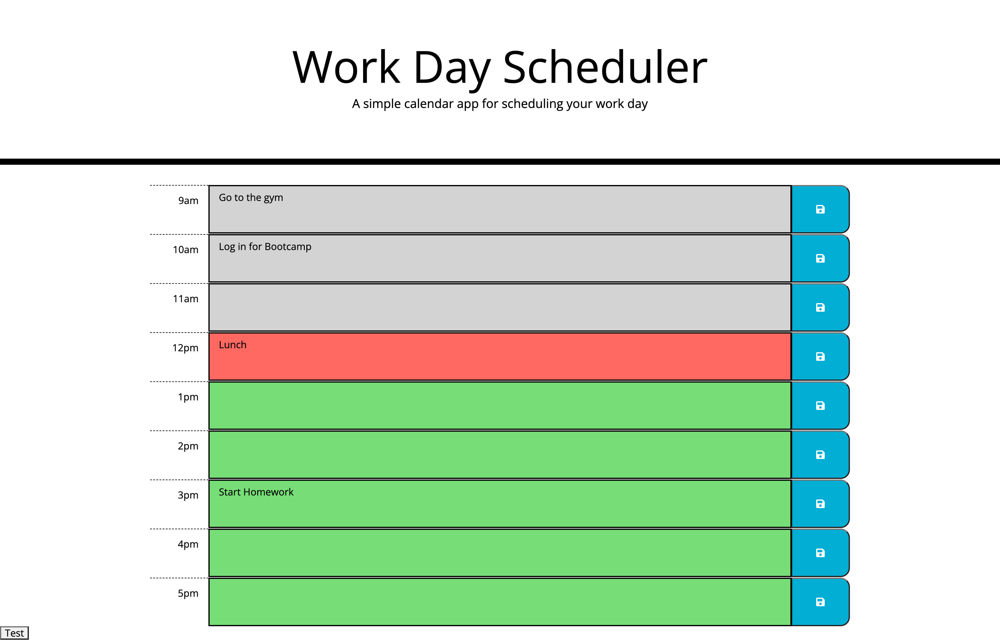

# Devon Faria - Daily-Planner

[Link to working page](https://devonfaria.github.io/devon-daily-planner/)

## Table of Contents

* [Description](#description)
* [Visuals](#visuals)
* [Support](#Support)
* [Contributions](#contributions)

## Description

Welcome to the daily planner application! Here, you can input daily tasks to a certain timeblock and save that content to the timeblock. When you click the save button, the text input for the sibling textarea will be saved an array in localStorage for the window. 

Whenever you reload this application, it uses the position in the for loop target a position in the stored array, and then take the array content at that position and dynamically enter the text into the loop-generated textarea at tht position.

Additionally, the timeblocks will show white if they have passed for the current day, show red if it is that current hour, and show green if it is an upcoming hour in the current day. 

## Visuals

The following layout is what you can expect to see on your browser.

This is what you page should look like if there is content in localStorage that has been saved previously.

## Support

Contact me at devonfaria@gmail.com if you need assistance downloading or activating this repository.

## Contributions

A huge thank you to Sasha Peters for helping me determine how to properly load the HTML page with elements using a for loop, and for properly parsing the information when retrieving from localStorage. A savior, I say!